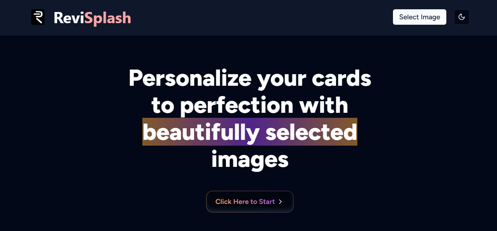

# RevSplash
Creating Memories...

### Introduction

A simple application to help users generate and design a personalized “thank you” card using images.

### Requirements

- **ImageSelection:** Use the Unsplash API to fetch four random images for the user to choose from.

- **Personalization:** Once an image is selected, overlay it with the user’s name at the bottom and the text “Thank You” at the top.

- **DownloadableImage:** The final personalized image should be downloadable by the user.

- **Dimensions:** The generated image should have a 4:5 aspect ratio and should occupy at least 20% of the screen.

### User Interface
-   Design a clean and intuitive user interface.

-   Use modern styling.

-   Ensure it is full responsive

-   Ensure ease of use and navigation.

### Responsive Design:
-   Make the application responsive to different screen sizes and devices.
-   Ensure that the user interface adapts smoothly to mobile, tablet, and desktop environments.

### Interactivity:
-   Add interactive elements to enhance user experience, such as buttons, forms, and feedback messages.
-   Implement smooth transitions and animations to make the application more engaging.

### Version Control and Documentation:
-   Use Git for version control and maintain a well-structured repository.
-   Include clear and concise documentation explaining how to set up and run the application locally.
-   Document any design decisions or trade-offs made during development.

### Technologies Used:
-   [NextJS with Typescript](https://nextjs.org/) - Next.js is a React framework for building full-stack web applications. You use React Components to build user interfaces, and Next.js for additional features and optimizations.
-   [TailwindCSS](https://tailwindcss.com/) - A utility-first CSS framework packed with classes like that can be composed to build any design, directly in your markup.
-   [ShadCN](https://ui.shadcn.com/) - Already beautifully designed components that you can copy and paste into your apps that are customizable.
-   [MagicUI](https://magicui.design/) - free and open-source animated components built with React, Typescript, Tailwind CSS, and Framer Motion. Perfect companion for shadcn/ui.
-   [Vercel](https://vercel.com/) - For Deployment. Vercel's Frontend Cloud provides the developer experience and infrastructure to build, scale, and secure a faster, more personalized web.

### Challenges Faced
- Faced a little challenge using the Magic UI CSS animated components but I have been meaning to use some animated framework's components. I love challenges and I set out to use MagicUI as opposed to ShadCN that I wasused to since I have never used it before and would love the experience. It was an amazing experience overall.

### Demo:

Deployed using Vercel:
[ReviSplash App](https://revisplash.vercel.app/)

#### Screenshot of the app:

### *Thank you for reading*